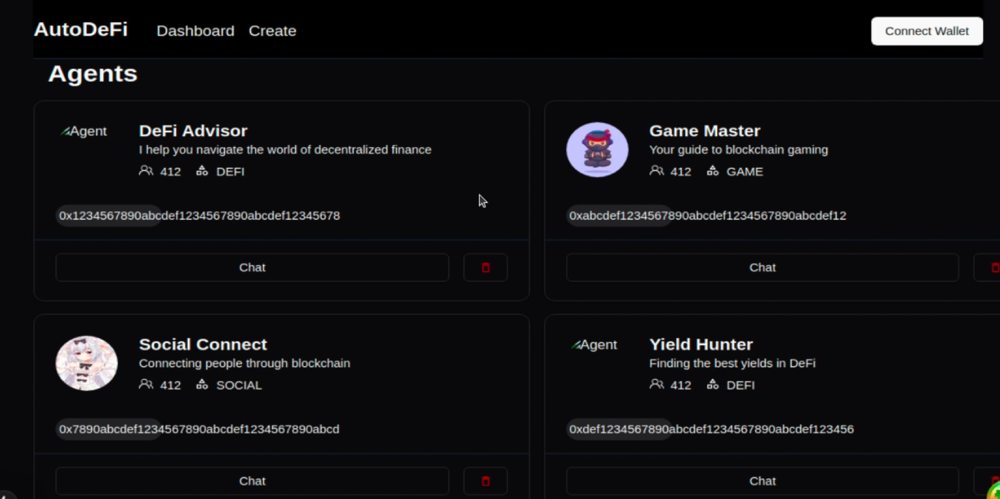

# AutoDeFi

AutoDeFi is an AI-powered platform that enables users to create, deploy, and interact with various types of blockchain agents on the Open Campus Codex network. The platform provides a user-friendly interface for creating and managing agents specialized in DeFi, gaming, and social interactions.



## Table of Contents

- [Overview](#overview)
- [Features](#features)
- [Technology Stack](#technology-stack)
- [Getting Started](#getting-started)
  - [Prerequisites](#prerequisites)
  - [Installation](#installation)
  - [Running the Application](#running-the-application)
- [Project Structure](#project-structure)
- [Creating Agents](#creating-agents)
- [Contributing](#contributing)
- [License](#license)

## Overview

AutoDeFi is a platform that bridges the gap between AI and blockchain technology. It allows users to create specialized agents that can perform various tasks on the Open Campus Codex blockchain, including:

- **DeFi Agents**: Help users navigate decentralized finance protocols, provide investment advice, and monitor market trends.
- **Game Agents**: Assist users in blockchain gaming environments, provide strategies, and enhance gaming experiences.
- **Social Agents**: Facilitate social interactions in Web3 spaces, manage community engagement, and coordinate social activities.

Each agent is deployed as a smart contract on the Open Campus Codex blockchain, ensuring transparency, security, and decentralized operation.

## Features

- **Agent Creation**: User-friendly interface to create custom AI agents with specific knowledge and capabilities.
- **Blockchain Integration**: Seamless integration with the Open Campus Codex blockchain (Chain ID: 656476, Currency: EDU).
- **Agent Dashboard**: Comprehensive dashboard displaying agent statistics and allowing easy management.
- **Real-time Chat**: Interactive chat interface to communicate with deployed agents.
- **MongoDB Integration**: Persistent storage of agent data and interactions.
- **OpenAI Integration**: Leveraging advanced AI models for natural language understanding and generation.

## Smart Contracts

All agent smart contracts created during hackathon: 
[0x3a18f9f0E07269D2a9161A0E83745b4e8BbAdEE8](https://edu-chain-testnet.blockscout.com/address/0x3a18f9f0E07269D2a9161A0E83745b4e8BbAdEE8?tab=txs)


## Technology Stack

- **Frontend**: Next.js, React, TailwindCSS
- **Backend**: NestJS, Node.js
- **Database**: MongoDB
- **Blockchain**: Open Campus Codex
- **AI**: OpenAI API
- **Authentication**: JWT-based authentication

## Demo / Pitch video

[](https://www.youtube.com/watch?v=8q8Qp6LvHSY)

## Getting Started

### Prerequisites

Before you begin, ensure you have the following installed:

- Node.js (v16 or later)
- npm or pnpm
- MongoDB (v4.4 or later)
- Git

### Installation

1. Clone the repository:

```bash
git clone https://github.com/GETOfinance/autodefai.git
cd autodefi
```

2. Install dependencies for both frontend and backend:

```bash
# Install backend dependencies
cd backend
npm install

# Install frontend dependencies
cd ../frontend
npm install
```

3. Set up environment variables:

Create a `.env` file in the backend directory with the following content:

```
PORT=8002
SKIP_MONGODB=false
MONGODB_URI=mongodb://localhost:27017/agentic-eth
OPENAI_API_KEY=your_openai_api_key
```

Create a `.env` file in the frontend directory with the following content:

```
NEXT_PUBLIC_BACKEND_URL=http://localhost:8002
```

### Running the Application

1. Start MongoDB:

```bash
# Create a directory for MongoDB data (if it doesn't exist)
mkdir -p /tmp/mongodb

# Start MongoDB as a background process
mongod --dbpath /tmp/mongodb --fork --logpath /tmp/mongodb.log
```

2. Start the backend server:

```bash
cd backend
npm run start:dev
```

3. In a new terminal, start the frontend server:

```bash
cd frontend
npm run dev
```

4. Access the application:

Open your browser and navigate to [http://localhost:5173](http://localhost:5173)

## Project Structure

```
autodefi/
├── backend/                 # NestJS backend
│   ├── src/
│   │   ├── core/            # Core modules
│   │   │   ├── resources/   # API resources
│   │   │   └── ...
│   │   ├── main.ts          # Application entry point
│   │   └── ...
│   ├── .env                 # Backend environment variables
│   └── ...
├── frontend/                # Next.js frontend
│   ├── components/          # React components
│   ├── lib/                 # Utility functions
│   ├── pages/               # Next.js pages
│   ├── .env                 # Frontend environment variables
│   └── ...
└── README.md                # Project documentation
```

## Creating Agents

1. Navigate to the "Create Agent" page from the dashboard.
2. Fill in the required information:
   - Agent Name: A unique name for your agent
   - Agent Type: Choose from DeFi, Game, or Social
   - Bio: A brief description of your agent
   - Knowledge: Specific knowledge areas for your agent
3. Click "Create Agent" to deploy your agent to the Open Campus Codex blockchain.
4. Once deployed, your agent will appear on the dashboard and be available for interaction.

## Interacting with Agents

1. From the dashboard, click on an agent card to open the chat interface.
2. Type your message in the input field and press Enter to send.
3. The agent will respond based on its knowledge and capabilities.

## Contributing

We welcome contributions to the AutoDeFi project! Please follow these steps:

1. Fork the repository
2. Create a feature branch (`git checkout -b feature/amazing-feature`)
3. Commit your changes (`git commit -m 'Add some amazing feature'`)
4. Push to the branch (`git push origin feature/amazing-feature`)
5. Open a Pull Request

## License

This project is licensed under the MIT License - see the LICENSE file for details.

## Acknowledgements

- Open Campus Codex for providing the blockchain infrastructure
- OpenAI for the AI capabilities
- All contributors who have helped shape this project

---

For questions or support, please open an issue on the GitHub repository or contact the maintainers directly.
